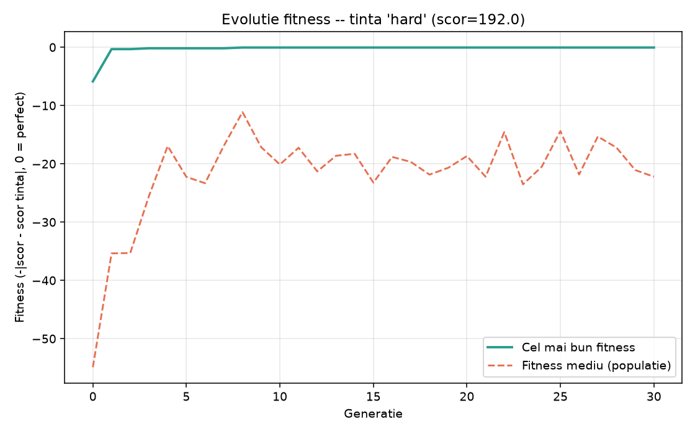

# AI Escape Room Generator

Generarea si optimizarea automata a nivelurilor pentru un joc de tip Escape
Room folosind algoritmi genetici si cautare BFS.

## Status implementare

- [x] Reprezentare grid (`src/grid.py`)
- [x] Generator procedural: labirint perfect (spanning tree) pe dificultati Easy/Medium/Hard (`src/generator.py`)
- [x] Validare nivel cu BFS: Start -> Key -> Door -> Exit, cu Cheia/Usa OBLIGATORII (nu doar posibile) (`src/solver.py`)
- [x] Plasare inamici / capcane / comori (in afara traseului critic)
- [x] **Scor de dificultate** (lungime traseu, nr. inamici, nr. capcane, nr. comori, densitate pereti), calibrat empiric (`src/difficulty.py`)
- [x] **Algoritm genetic** (selectie prin turneu, crossover uniform, mutatie gaussiana, elitism) care cauta parametrii al caror scor e cel mai aproape de o tinta -- functioneaza si pentru scoruri intermediare, nu doar Easy/Medium/Hard (`src/genetic.py`)
- [x] **Grafic evolutie fitness** pe generatii, salvat ca PNG (Matplotlib) (`src/plot_fitness.py`)
- [x] CLI text pentru generare + vizualizare (`src/main.py`, `src/run_genetic.py`)
- [x] Export JSON pentru front-end (`src/export_json.py`)
- [x] Front-end Unity 3D (randare + camera + lumina + tema de culori + textura proceduala) -- `unity/`
- [x] Personaj jucabil (miscare pe grid, WASD/sageti) cu interactiuni: cheie, usa, inamici/capcane (vieti), comori (scor)
- [x] Alegerea dificultatii direct din Unity (dropdown la Play sau butoane Easy/Medium/Hard in HUD)
- [x] Regenerare automata a unui nivel nou la victorie (Unity cheama Python ca subproces)

Tot ce era in tema initiala e implementat. Ce s-ar mai putea rafina: legarea
directa a algoritmului genetic de butoanele din Unity (acum Unity foloseste
generarea directa, mai rapida; algoritmul genetic e disponibil separat prin
`run_genetic.py`, pentru precizie mai mare pe un scor tinta exact).

## Evolutia fitness-ului (exemplu)



Fitness = `-|scor_obtinut - scor_tinta|` (0 = perfect). Linia continua e cel
mai bun individ din fiecare generatie (nu scade niciodata, datorita
elitismului); linia punctata e media populatiei.

## Arhitectura: Python = creierul, Unity = front-end-ul

Python genereaza nivelul, il valideaza cu BFS, calculeaza scorul de
dificultate si (optional) il optimizeaza cu algoritmul genetic. Rezultatul e
exportat ca JSON. Unity doar citeste JSON-ul si il randeaza -- nu genereaza
si nu valideaza nimic singur.

```
ai-escape-room-generator/     <- radacina repo-ului (monorepo)
  src/
    grid.py                    <- reprezentarea hartii
    solver.py                   <- BFS: cauta drum + valideaza (Cheia/Usa obligatorii)
    generator.py                 <- labirint perfect + plasare continut
    difficulty.py                 <- scor de dificultate (NumPy)
    genetic.py                     <- algoritm genetic (selectie/crossover/mutatie/elitism)
    plot_fitness.py                 <- grafic evolutie fitness (Matplotlib)
    export_json.py                   <- exporta un nivel ca JSON (pt. Unity)
    main.py                           <- CLI: genereaza direct un nivel
    run_genetic.py                     <- CLI: optimizeaza cu algoritmul genetic
  tests/                        <- teste Python (11 teste)
  docs/                         <- grafice exemplu, capturi
  unity/                        <- proiect Unity (front-end)
    Assets/Scripts/
      LevelData.cs              <- oglinda JSON-ului exportat din Python
      LevelRenderer.cs           <- randare 3D + cheama Python (subproces)
      LevelHUD.cs                 <- overlay: status, legenda, butoane dificultate
      PlayerController.cs          <- miscare pe grid + interactiuni
      Bobber.cs                     <- animatie idle (plutire/rotatie)
    Assets/StreamingAssets/level.json   <- nivelul curent (generat, nu e sursa -- gitignored)
```

Unity gaseste automat folderul `src/` (presupune ca `unity/` si `src/` sunt
frati sub aceeasi radacina) si `python` din PATH -- nu sunt cai hardcodate.
Daca nu merge pe o masina noua, se pot suprascrie manual `pythonExecutable`
/ `pythonScriptDir` in Inspector, pe componenta `LevelRenderer`.

### Workflow

```bash
# 1. (optional -- Unity o face oricum automat la Play) genereaza si exporta manual un nivel
python src/main.py --difficulty medium --export unity/Assets/StreamingAssets/level.json

# 2. Deschide 'unity/' ca proiect in Unity Hub, apasa Play
#    (scena se creeaza automat -- nu trebuie configurat nimic manual)
#    Dificultatea se alege din Inspector (campul "Start Difficulty" pe
#    LevelRenderer) inainte de Play, sau din butoanele Easy/Medium/Hard din HUD.

# 3. In Play Mode: WASD/sageti = miscare, L = reincarca JSON-ul curent,
#    N = nivel nou (aceeasi dificultate), +/- = zoom
```

## Rulare (doar partea Python, fara Unity)

```bash
pip install -r requirements.txt

# generare directa (rapida, ~100% valida, dar dificultatea e "aproximativa")
python src/main.py --difficulty easy
python src/main.py --difficulty medium --seed 42
python src/main.py --difficulty hard

# optimizare cu algoritm genetic (mai lenta, dar scorul iese mult mai precis)
python src/run_genetic.py --difficulty hard
python src/run_genetic.py --target-score 130 --generations 50 --population 40
python src/run_genetic.py --difficulty medium --export unity/Assets/StreamingAssets/level.json
```

## Teste

```bash
python tests/test_solver.py
python tests/test_difficulty.py
python tests/test_genetic.py
```

(sau, daca ai `pytest` instalat: `pytest tests/`)

## Colaborare

**Setup pentru cine se alatura:**
1. `git clone https://github.com/mvriivs/ai-escape-room-generator.git`
2. Python: `pip install -r requirements.txt`
3. Unity: instaleaza [Unity Hub](https://unity.com/download), apoi in Hub ->
   "Add project from disk" -> selecteaza folderul `unity/`. Necesita Unity
   **6000.5.3f1** (sau apropiat) instalat -- Hub-ul cere sa-l instalezi daca
   nu-l ai.
4. Nu trebuie configurat nimic manual in Unity -- la Play, scena si tot
   continutul se construiesc automat din cod.

**Flux de lucru recomandat (evita conflictele):**
- Fiecare lucreaza pe un branch propriu (`git checkout -b nume/feature`) si
  deschide Pull Request spre `main`, in loc sa dea push direct pe `main`.
- Inainte sa incepi de lucru: `git pull origin main`.
- **Partea Unity** (`unity/Assets/Scripts/*.cs`) e cod C# normal -- se
  merge-uieste text ca orice alt cod, fara probleme.
- **Scena Unity** (`unity/Assets/Scena.unity`) e practic goala (totul se
  construieste la runtime din script, vezi `LevelRenderer.Bootstrap()`) --
  deci foarte putin motiv sa apara conflicte acolo. Daca totusi cineva
  adauga obiecte manual in scena, mai bine anuntati-va reciproc inainte, ca
  sa nu editati scena in acelasi timp amandoi.
- `.gitattributes` e deja configurat sa trateze fisierele Unity (`.unity`,
  `.prefab`, `.asset`, `.meta`) ca text, cu `unityyamlmerge` ca merge tool --
  daca apare totusi un conflict pe un fisier Unity, cea mai sigura solutie
  e sa alegi o singura varianta completa (`--ours`/`--theirs`), nu editare
  manuala linie cu linie.
- `Library/`, `Temp/`, `Logs/` sunt gitignored -- fiecare le regenereaza
  local (Unity le recreeaza automat la prima deschidere), nu se urca pe git.

**Ca sa adaugi pe cineva ca sa poata da push direct** (optional, alternativa
la Pull Requests de la un fork): pe GitHub, `Settings` -> `Collaborators` ->
`Add people` -> username/email -> persoana primeste o invitatie pe care
trebuie sa o accepte.

## Legenda simboluri

| Simbol | Semnificatie |
|--------|--------------|
| `#`    | Perete       |
| `.`    | Podea liber  |
| `S`    | Start        |
| `K`    | Key (cheie)  |
| `D`    | Door (usa) -- blocata pana culegi cheia |
| `E`    | Exit         |
| `X`    | Inamic (te loveste: -1 viata, te trimite la Start) |
| `T`    | Capcana (la fel ca inamicul) |
| `$`    | Comoara (se aduna la scor) |
